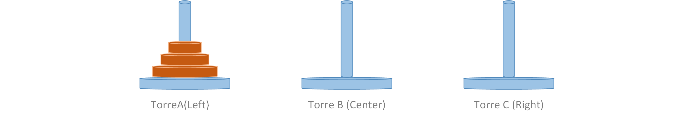
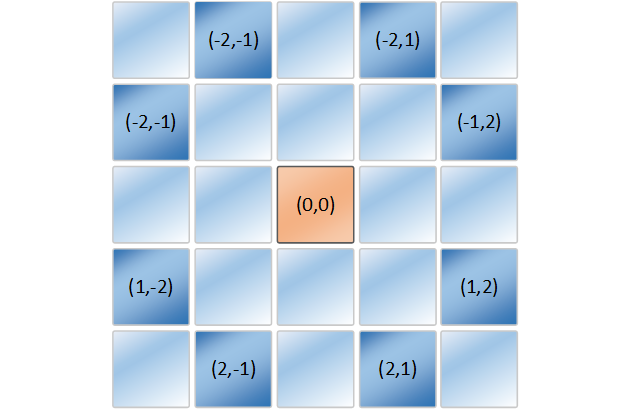
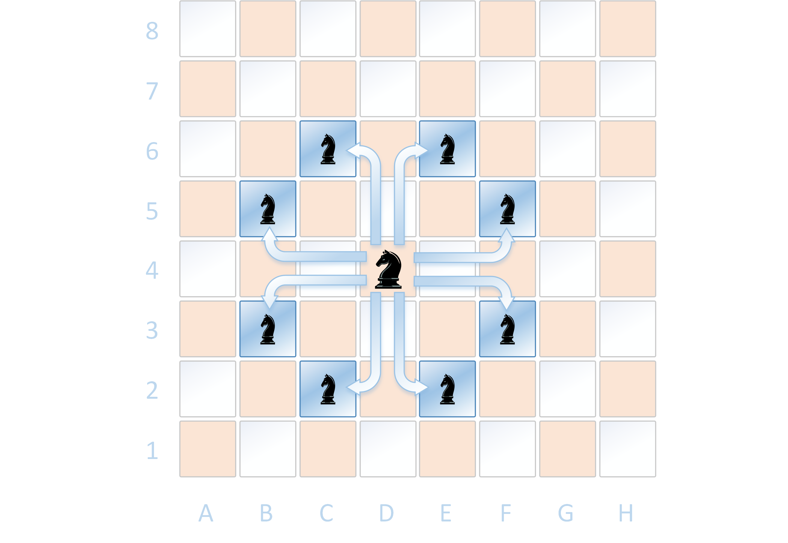
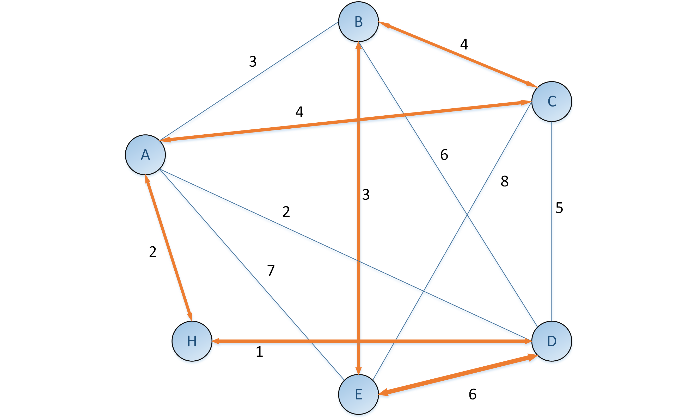

# Proyecto de Declarativa

### Integrantes:

- Daniel de la Cruz Prieto


### Torres de Hanoi (ejercicio 1)

La solución esta en el fichero *hanoi.pl*, esta solución que implemente es la 
típica a problemas de recursividad. 

Lo primero que defini fue el predicado ```hanoi(N)``` que lo defini de la manera siguiente: 
```
hanoi(N):-move(N,'A','C','B').
```

Este es el predicado global para la  ejecución del programa, donde *N* es la cantidad de 
discos que hay inicialmente en la pila A(la de la izquierda).  

Como lo que queremos es mover todos los discos de izquierda a derecha cumpliendo que en todo momento 
del procedimiento se cumpla que ningún disco se coloque sobre otro disco con un diámetro menor. 
Asumimos que inicialmente todos los discos se encuentran colocados en la torre de la izquierda (Torre A )
con el objetivos de que queden puestos en el mismo orden en la Torre de la derecha(Torre C). 

Por ejemplo en la figura de abajo se muestra como debe ser la disposición inicial para tres discos

 

El caso base (caso de poda del algoritmo) queda de la siguiente manera: 
```
move(0,_,_,_):-!.
```
Que es el caso en el que no quedan mas discos por mover por lo tanto este sería nuestro caso 
base en el procedimiento. 

El caso generan que es para un *N* cualquiera que sea mayor que cero lo definimos con el 
predicado siguiente: 

```
move(N,Left,Right,Center):-
            M is N-1,
            move(M,Left,Center,Right),
            printmove(Left,Right),
            move(M,Center,Right,Left).
```

Como vemos estos predicados triunfan siempre que *N* sea mayor o igual que cero, pues 
si *N* es menor que cero, habrían infinitos de casos a analizar, por lo que el programa
caería en un ciclo infinito porque nunca caería en el caso de poda, que es el caso base para
*N = 0* 


El predicado ```printmove(X,Y)``` siempre triunfa porque lo único que hace es imprimir en la salida. 
Este predicado esta definido de la siguiente manera:

```
printmove(X,Y):-
            writelist([move, a, disk, from, X, to, Y]),
            nl.
```

Este predicado siempre truinfa porque el predicado ```writelist([H|T])``` siempre 
triunfa y lo que hace es imprimir en la salida la secuencia de hechos que le pasamos.
Al igual que siempre triunfa el predicado ```nl.``` que lo que hace es saltar a una nueva linea
para darle un formato claro a lo que se pone en la salida.  

El predicado ```writelist([H|T])``` lo definimos de la siguiente manera: 

```
writelist([]).
writelist([H|T]):-write(H),
        write(' '),
        writelist(T).
```

Para *N=3* el programa da la salida que se muestra a continuación, este código que se muestra 
se corrió con el interprete de ***SWI-PROLOG*** con *version 8.2.4* para 64 bits*.

```
?- hanoi(3).
move a disk from A to C 
move a disk from A to B 
move a disk from C to B 
move a disk from A to C 
move a disk from B to A 
move a disk from B to C 
move a disk from A to C 
true.
```
El código completo esta en el mismo directorio en que se encuentra este documento con el 
nombre de *hanoi.pl*. 


### Recorrido del Caballo (ejercicio 2) 

La solución del problema esta en el fichero *recorridodelcaballo.pl*, esta solución analiza todos los 
posibles casos partiendo desde una casilla en especifico del tablero de ajedrez 
para el programa supuse que el tablero era de *8X8* (un tablero de ajedrez).  

Se definen los hechos siguientes para poder determinar los movimientos que puede tener
un caballo dado una posición hacia otra valida por el tipo de movimiento que hace este 
(es decir moverse en forma de L). A continuación se definen estos hechos. 

```
dxy(2,1).
dxy(2,-1).
dxy(-2,1).
dxy(-2,-1).
dxy(1,2).
dxy(1,-2).
dxy(-1,2).
dxy(-1,-2).
```
Definimos el predicado ```nexmove(N,X/Y,X1/Y1)``` que es para determinar dado una posición
dada, las próximas posiciones validas que puede alcanzar el caballo en el tablero.

```
nexmove(N,X/Y,X1/Y1):-
    dxy(A,B),
    X1 is A+X,
    X1 >= 1,
    X1 =< N,
    Y1 is B+Y,
    Y1 >= 1,
    Y1 =< N.
```

Nuestro predicado lo que hace es determinar los posiciones sumando o restando las columnas
y filas de la posición actual para determinar la posición de la fila y la columna de la 
próxima casilla que pudiera ser valida para un movimiento del caballo. Abajo se muestra cuales
son las casillas validas a moverse desde una posición dada y sus movimientos dados en *(fila,columna)*.



Por ejemplo si llamamos al predicado desde la posición [4,4] nos da el siguiente resultado,
que son todas las posibles casos en que triunfa el predicado ```nexmove(N,X/Y,X1/Y1)```.

```
 ?- nexmove(8,4/4,P).
P = 6/5 ;
P = 6/3 ;
P = 2/5 ;
P = 2/3 ;
P = 5/6 ;
P = 5/2 ;
P = 3/6 ;
P = 3/2.
```

Es decir desde la posición [4,4] se pueden dar los saltos a las casillas (6,5),(6,3),
(2,5),(2,3),(5,6),(5,2),(3,6),(3,2) como se muestra en la figura de abajo. 




El predicado ```recorrido(N,P1,P2,R)``` verifica si R es un recorrido de un caballo
en un tablero de dimensiones NxN sin pasar dos veces por la misma casilla.

El predicado ```recorridoauxiliar(N,P1,[P2|R1],R)`` verifica si R es un recorrido de un
caballo en un tablero de dimensiones NxN , aquí se verifica que este en una posición valida
para el próximo movimiento y ademas se verifica que no este el próximo movimiento en el 
recorrido R. Los predicado se definen de la siguiente manera: 

```
recorrido(N,P1,P2,R):-
    recorridoauxiliar(N,P1,[P2],R).

recorridoauxiliar(_,P,[P|R],[P|R]):-!.
recorridoauxiliar(N,P1,[P2|R1],R):-
    nexmove(N,P2,P3),
    not(member(P3,[P2|R1])),
    recorridoauxiliar(N,P1,[P3,P2|R1],R).

```

EL predicado ```recorridocaballo(N,X/Y,R)``` verifica el predicado recorrido desde una posición inicial 
determinada (X,Y): Se define como se muestra abajo:  

```
recorridocaballo(N,X/Y,R):-
    M is N*N,
    length(R1,M),
    recorrido(N,_,X/Y,R1),
    reverse(R1,R).

```
El código completo esta en el fichero *recorridodelcaballo.pl* que esta en el mismo directorio 
donde se encuentra este documento. 


### El viajante(ejercicio 3) 

El problema lo vamos a ver como una representación de un grafo dirigido y ponderado donde los vértices son las 
ciudades y las caminos son las aristas con su respectivo peso. (en general un grafo no dirigido se puede representar como un 
grafo dirigido que cumple 'simetría' en sus aristas , es decir si exista la arista *a-b* también existe la
arista *b-a* con el mismo peso ambas). 

Entonces la solución va de encontrar todas las posibles recorridos y quedarnos con el menor, 
teniendo en cuenta que si hemos encontrado un camino *p* con longitud *k* y en algún momento de
la búsqueda de una solución nos encontramos que el camino actual, digamos *p1* que tiene una longitud mayor que *k* , entonces no sería una
solución factible porque estamos buscando todos los caminos cuya longitud sea mínima, entonces no 
seria factible seguir analizando el camino *p1*.

Primero defino los hechos para definir las aristas y sus respectivos pesos, lo que 
queda definido de la siguiente manera: 

```
arista(a, b, 3).
arista(a, c, 4).
arista(a, d, 2).
arista(a, e, 7).
arista(b, c, 4).
arista(b, d, 6).
arista(b, e, 3).
arista(c, d, 5).
arista(c, e, 8).
arista(d, e, 6).
arista(b, a, 3).
arista(c, a, 4).
arista(d, a, 2).
arista(e, a, 7).
arista(c, b, 4).
arista(d, b, 6).
arista(e, b, 3).
arista(d, c, 5).
arista(e, c, 8).
arista(e, d, 6).
arista(a, h, 2).
arista(h, d, 1).
```

Entonces primero definimos el siguiente predicado para saber la cantidad de elementos
que tiene una lista. el predicado queda como sigue: 

```
longitud([], 0).
longitud([H|T], N):- longitud(T, X), N is X+1.
```


El predicado recorrido define un recorrido y lo extiende y toma la distancia hasta 
el nodo actual que se ejecuta y los nodos visitados hasta el momento. 

los demás predicados se derivan y se llaman entre ellos para determinar los nodos a visitar
marcándolos como visitados añadiendo las distancias de las aristas que se van visitando 
y hace las llamadas recursivas para añadir y ver las posibles soluciones en el árbol de backtrack 
que se va formando en cada unificación. Siempre teniendo  en cuenta de no analizar los 
recorridos que no cumplan con al condición que sean de mayor longitud que un recorrido 
ya previamente calculado 

Aquí en el ejemplo tenemos un grafo de  7 nodos por eso comparamos con 7 la longitud de 
las lista de los nodos visitados.

```
recorrido(Comienzo, Fin, Visitado, Total) :-
    recorrido(Comienzo, Fin, [Comienzo], Visitado, 0, Total).


recorrido(Comienzo, Fin, ActualL, Visitado, Coston, Total) :-
    arista(Comienzo, Final, Distancia),
    NuevoCosto is Coston + Distancia,
    \+ member(Final, ActualL),
    recorrido(Final, Fin, [Final|ActualL], Visitado, NuevoCosto, Total).


recorrido(Comienzo, Fin, ActualL, Visitado, Coston, Total) :-
    arista(Comienzo, Fin, Distancia), 
    reverse([Fin|ActualL], Visitado), 
    longitud(Visitado, Q),
    (Q\=7 -> Total is 100000; Total is Coston + Distancia).
```


El predicado mejor compara dos longitudes de dos recorridos y determina si podar 
un recorrido en especifico , porque sea menor que una ya previamente calculado.
Se asume como tope superior para el los costos de las aristas 100000.


```
mejor(Costo-CPropio,MCosto-_,Costo-CPropio):- Costo<MCosto,!.
mejor(_,X,X).
```


El predicado tomar determina que recorrido es valido para seguir en el árbol recursivo que 
se forma.

```
Tomar([Costo-CPropio|R],X):-
    Tomar(R,MCosto-BPropio),
    mejor(Costo-CPropio,MCosto-BPropio,X),
    !.
Tomar([X],X).
```

Para saber el mejor recorrido lo que hacemos es llamar al predicado ```recorridoViajante(Recorrido)```
esto nos devuelve una lista con la secuencia de nodos a seguir para completar el recorrido
En nuestro ejemplo la salida seria como se muestra a continuación:

```
?- recorridoViajante(Recorrido).
Recorrido = 20-[a, h, d, e, b, c, a].
```

Como se muestra en el gráfico de abajo , es el ejemplo del código descrito arriba.

 

Todos los códigos están en el mismo directorio con los nombre:

- elviajante.pl
- hanoi.pl
- recorridocaballo.pl